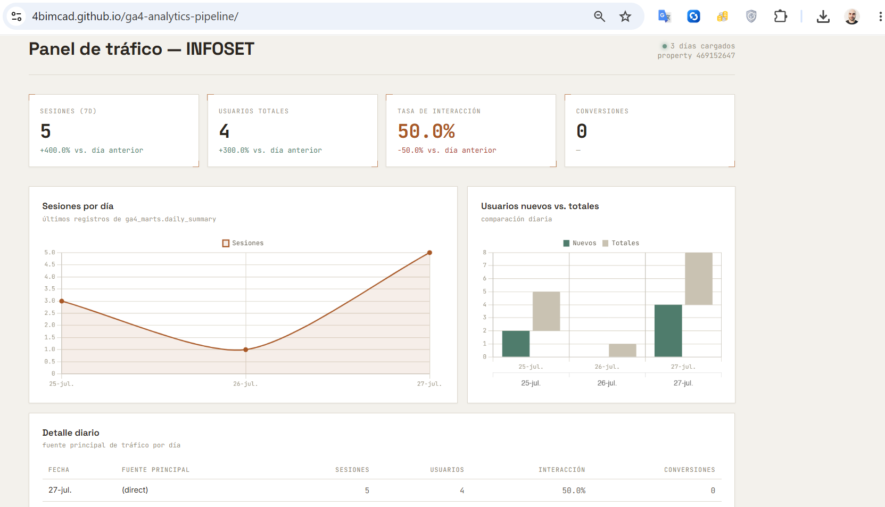

# GA4 Analytics Pipeline

An automated ETL pipeline that extracts daily traffic, events, pages, and conversion data from **Google Analytics 4** via the GA4 Data API, loads it into **PostgreSQL (Supabase)**, and visualizes it through a lightweight **Chart.js dashboard** served over the Supabase REST API.

Built as a companion project to [sales-analytics-pipeline](https://github.com/4bimcad/sales-analytics-pipeline), extending the same ETL pattern to an external marketing-analytics API instead of a transactional database.



---

## Architecture

```
┌─────────────────┐      ┌──────────────────┐      ┌───────────────────────┐
│  GA4 Data API    │ ───► │  Python extractor │ ───► │  PostgreSQL (Supabase) │
│  (BetaAnalytics  │      │  extract_ga4.py    │      │  ga4_raw + ga4_marts   │
│   DataClient)    │      │  runs via GitHub   │      │  schemas               │
└─────────────────┘      │  Actions (daily    │      └───────────┬───────────┘
                          │  cron + manual     │                  │
                          │  dispatch)         │                  │ REST API
                          └────────────────────┘                  ▼
                                                          ┌───────────────────┐
                                                          │  Chart.js dashboard │
                                                          │  (static HTML,      │
                                                          │  GitHub Pages)      │
                                                          └───────────────────┘
```

**Flow:**
1. A scheduled GitHub Actions workflow runs `extract_ga4.py` once a day (plus on-demand via `workflow_dispatch`).
2. The script authenticates to the GA4 Data API using a service account and pulls a rolling 3-day window (`today - 3` → `today`) to account for GA4's data-processing latency.
3. Raw rows are upserted into `ga4_raw` tables (`daily_traffic`, `daily_events`, `daily_pages`, `daily_conversions`) using `ON CONFLICT ... DO UPDATE`, so re-processed GA4 data always overwrites stale values instead of duplicating rows.
4. A SQL aggregation step refreshes `ga4_marts.daily_summary` — a single denormalized table with one row per day, purpose-built for the dashboard.
5. A static HTML dashboard queries `ga4_marts.daily_summary` directly from the browser via Supabase's PostgREST API, using a public, read-only key scoped by Row Level Security.

---

## Why a 3-day rolling window + upsert

GA4 does not finalize a day's metrics immediately — data can take 24–48 hours to fully process. Instead of writing only "yesterday," the extractor re-writes the last 3 days on every run. Combined with a unique constraint on `(report_date, dimensions...)` and `ON CONFLICT DO UPDATE`, this means:

- Early (incomplete) numbers get silently corrected once GA4 finalizes them.
- No duplicate rows accumulate across runs.
- The historical table grows by exactly one new day per run, with the last 3 days continuously refined.

---

## Tech stack

| Layer | Technology |
|---|---|
| Data source | Google Analytics 4 Data API (`google-analytics-data`) |
| Extraction | Python 3.11, `psycopg2` |
| Storage | PostgreSQL via Supabase (schemas: `ga4_raw`, `ga4_marts`) |
| Orchestration | GitHub Actions (scheduled cron + manual trigger) |
| API layer | Supabase auto-generated REST API (PostgREST) with Row Level Security |
| Visualization | Chart.js, vanilla HTML/CSS/JS, served via GitHub Pages |

---

## Database schema

**`ga4_raw`** — one row per day per dimension combination, mirrors the GA4 API response shape:
- `daily_traffic` — sessions, users, engagement, bounce rate, by source/medium/campaign/device/country
- `daily_events` — event name, count, users
- `daily_pages` — page path, views, users, avg. engagement time
- `daily_conversions` — conversion event, source/medium, conversions, revenue

**`ga4_marts`** — analytics-ready aggregates:
- `daily_summary` — one row per day: total sessions, users, engagement rate, conversions, conversion rate, top traffic source

---

## Setup

1. **Google Cloud** — create a project, enable the Google Analytics Data API, create a service account, download its JSON key.
2. **GA4** — grant the service account's email `Viewer` access under Admin → Property Access Management. Note the numeric Property ID from Admin → Property Settings.
3. **Supabase** — run the DDL to create `ga4_raw`/`ga4_marts` schemas and tables, enable RLS, and grant `SELECT` to `anon`:
   ```sql
   GRANT USAGE ON SCHEMA ga4_marts TO anon;
   GRANT SELECT ON ga4_marts.daily_summary TO anon;
   ```
   Also expose the `ga4_marts` schema and the `daily_summary` table under Project Settings → Data API.
4. **GitHub Secrets** — add `GA4_PROPERTY_ID`, `GA4_CREDENTIALS_JSON` (full service account JSON), and `DATABASE_URL` (Supabase connection string, transaction pooler recommended for CI runners).
5. **Run** — trigger the workflow manually from the Actions tab, or wait for the daily cron.
6. **Dashboard** — open `index.html` (or the GitHub Pages URL), update `SUPABASE_URL` and `SUPABASE_ANON_KEY` at the top of the script if you fork this for a different project.

---

## Security notes

- The dashboard uses Supabase's **publishable key** only — never the secret/service-role key, which would bypass Row Level Security if exposed client-side.
- The GA4 service account JSON and database credentials are stored exclusively as GitHub Actions secrets, never committed to the repository.

---

## Related projects

- [sales-analytics-pipeline](https://github.com/4bimcad/sales-analytics-pipeline) — PostgreSQL/Python/GitHub Actions ETL for sales data, following the same extraction/upsert pattern.
